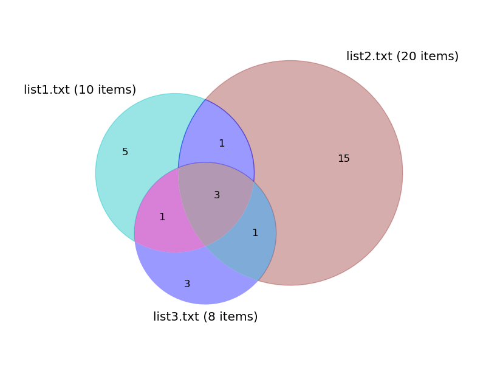

# text_mining
**My general text mining and text manipulation Python scripts.**

---


**Description of each script**


-`find_overlap_in_lists_with_Venn.py`
>  lists --> list of shared items and a diagram showing relationships between lists  
Like `find_overlap_in_lists.py` (see below), except for in the cases of comparisons involving 2 or 3 list documents, it produces an area-weighted Venn diagram (image file) depicting the relationships of the items in the lists. 
For comparing 4 lists, a Venn diagram will also be generated but it will not be area-wighted. To produce a Venn diagram for comparing lists found in four separate documents, it requires `venn4_from_github.py` (see below) in the same directory. This additional script is not needed in the cases comparing two or three lists.  
Note: this will not work to produce a Venn diagram on [mybinder.org](http://mybinder.org) because issues with `matplotlib` despite the fact the image is set to be saved as a file by default.  
See `find_overlap_in_lists.py` below for additional details.

**Usage**  

```
usage:  find_overlap_in_lists.py [-h] [-s] [-n] Files [Files ...]
find_overlap_in_lists.py takes any number of files of lists with items on
separate lines and reports those items shared by all. It was originally
intended to be used for lists of genes, but works on any lists. When comparing
2, 3, or four lists to each other, a Venn diagram depicting the relationship
of the lists will be made. Only the output for two or three lists will be an
area-weighted diagram.**** Script by Wayne Decatur (fomightez @ github) ***  

positional arguments:
  Files            List the names of FILES containing the lists to compare. AT
                   LEAST ONE IS REQUIRED. Of course, it makes more sense with
                   two or more.  
                   
optional arguments:
  -h, --help       show this help message and exit
  -s, --sensitive  add this flag to force comparison of items to be case-
                   sensitive (NOT recommended). Default (recommended) is to
                   make the comparisons independent of character case in order
                   make matching more robust, and not miss matches when case
                   use is inconsistent among the lists.
  -n, --nodiagram  add this flag to force not making any Venn diagram. (Or you
                   could just use my script 'find_overlap_in_lists.py' that
                   does the same without producing a diagram.)
```

**example of input and output for `find_overlap_in_lists_with_Venn.py`:**

**original input:**  
(text in three files with each column below representing contents of a file)
```
YDR190C                     YPR366C                 YDR112C
YPL235W                     YDr190C                 YdR190c
YLR366c                     YpL235W                 YPL235w
urgOu                       YLR466C                 YLR356C
SVLVASGYRHNITSVSQ           urgou                   SVLVASGYRHNITSVSQ
YCL063W                     SVLVASGYRHNITSVSQ       YFL037W
YML022W                     YBR845C                 YCL765C
YCR003W                     YDR772W                 YML022W
YIL007C                     YDL013W
                            YDL206W
                            YLR173W
                            YOR246C
                            YAL047C
                            YFL037W
                            YLR200W
                            YML124C
                            YER020C
                            YHL018W
                            YKL022C
                            YML100W
                            


```

**command:**

    python find_overlap_in_lists_with_Venn.py list1.txt list2.txt list3.txt   

**output after run:**  
(text in a file, called `list1_and_2others_shared_items.txt` , with the contents below)
```
YDR190C
YPL235W
SVLVASGYRHNITSVSQ


```
(image file called `list1_and_2others_overlap_representation.png`)  


---

- `find_overlap_in_lists.py`

> lists --> list of shared items  
Takes files with items listed one item to a line and determines items that occur in all the lists. Thus, it identifies only those items shared by all the lists of items. It was intended to be used for lists of genes, it but can work for any type of list.  
A file listing the shared items (genes) will be produced.  
The default settings cause the comparisons to be case-insensitive with the caveat that the case of the shared items listed in the output file will be determined by whatever list is provided in the first position of the file name list when calling the script.  
Matching independent of case is done by default to make the comparisons more robust. The optional flag `--sensitive` can be used to override that behavior and make the comparisons case-sensitive. For case-sensitive matching, the order of the files when the script is called makes no difference as only perfect matches for all input lists will be in the output file.
Note, if using with yeast genes, probably best to use my script `geneID_list_to_systematic_names.py`, found in [my yeastmine-related code repository](https://github.com/fomightez/yeastmine) to convert all to yeast systematic names so that the lists are standardized before running `find_overlap_in_lists.py`.  
A related script, `find_overlap_in_lists_with_Venn.py`, (see above) will do all this script will do plus when comparing 2, 3, or 4 lists it depict the relationships among the lists in a Venn diagram.

**Usage**  

```
usage:  find_overlap_in_lists.py [-h] [-s] Files [Files ...]
find_overlap_in_lists.py takes any number of files of lists with items on
separate lines and reports those items shared by all. It was originally
intended to be used for lists of genes, but works on any lists. **** Script by
Wayne Decatur (fomightez @ github) ***  

positional arguments:
  Files            Names of files containing lists to compare. AT LEAST ONE
                   REQUIRED.  
                   
optional arguments:
  -h, --help       show this help message and exit
  -s, --sensitive  add this flag to force comparison of items to be case-
                   sensitive (NOT recommended). Default (recommended) is to
                   make the comparisons independent of character case in order
                   make matching more robust, and not miss matches when case
                   use is inconsistent among the lists.
```

**example of input and output for `find_overlap_in_lists.py`:**

**original input:**  
(text in three files with each column below representing contents of a file)
```
YDR190C                     YPR366C                 YDR112C
YPL235W                     YDr190C                 YdR190c
YLR366c                     YpL235W                 YPL235w
urgOu                       YLR466C                 YLR356C
SVLVASGYRHNITSVSQ           urgou                   SVLVASGYRHNITSVSQ
                            SVLVASGYRHNITSVSQ
                            YBR845C
                            YDR772W
                            YDL013W
                            YDL206W
                            YLR173W
                            YOR246C
                            YAL047C
                            YFL037W
                            YLR200W
                            YML124C


```

**command:**

    python find_overlap_in_lists.py list1.txt list2.txt list3.txt   

**output after run:**  
(text in a file, called `list1_and_2others_shared_items.txt` , with the contents below)
```
YDR190C
YPL235W
SVLVASGYRHNITSVSQ


```

---

- `pull_MATCHING_data_from_files_in_directory.py`

> pertinent lines in several files --> all those lines in one file  
`pull_MATCHING_data_from_files_in_directory.py` takes a directory as an argument and mines for lines in thar file matching the text of interest. It only mines the files that match constraints set for the file names. All the lines get saved to ine file.

For the current version, the text of interest to match and the file name constraints are set as user set values in the code.

---


- `venn4_from_github.py`

> slightly modified from the original by Kristoffer Sahlin [here](https://github.com/ksahlin/pyinfor/blob/master/venn.py) to be used with `find_overlap_in_lists_with_Venn.py`  


Related scripts
---------------

Since data mining and text manipulations are at the heart of most of my computational endeavors, several other of my code repositories hold code related to text mining/text manipulation. Here are some:

- [My YeastMine code repository](https://github.com/fomightez/yeastmine) 

- [My sequence work repository](https://github.com/fomightez/sequencework)

- [My structure work repository](https://github.com/fomightez/structurework)
